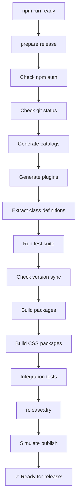

# 🚀 Automated Development Workflow

This document describes the fully automated workflow for developing, testing, and releasing @casoon/tailwindcss-effects packages. The system prevents common release mistakes and ensures consistency across all packages.

> **🎯 TL;DR**: Use `npm run ready` before any release. It does everything automatically and catches issues early.

## 📋 Quick Commands Overview

| Command | Description | Safety Level | When to Use |
|---------|-------------|--------------|-------------|
| `npm run ready` | **🎯 Ultimate workflow** - Full prep + dry-run | 🛡️ **Maximum** | Before any release |
| `npm run prepare:release` | Complete pre-release preparation | 🛡️ High | Before releasing |
| `npm run release:dry` | Test release without publishing | 🛡️ High | To verify release |
| `npm run release:all` | **Publish all packages** | ⚠️ LIVE | Final release step |
| `npm run version:patch` | Bump patch + full preparation | 🛡️ High | Bug fixes (0.0.X) |
| `npm run version:minor` | Bump minor + full preparation | 🛡️ High | New features (0.X.0) |
| `npm run version:major` | Bump major + full preparation | 🛡️ High | Breaking changes (X.0.0) |

## 🎯 Recommended Development Workflow

### 💡 **Step-by-Step Process**

```bash
# 1. 🧪 DEVELOPMENT PHASE
# - Make your changes to packages
# - Add new features, fix bugs, etc.

# 2. 🔍 PRE-RELEASE CHECK (ALWAYS START HERE)
npm run ready
# ↳ This runs EVERYTHING and simulates the release
# ↳ Catches issues before they become problems

# 3. 📝 COMMIT YOUR CHANGES (if ready passed)
git add .
git commit -m "feat: add new glassmorphism effects"

# 4. 🏷️ VERSION BUMP (if needed)
npm run version:patch    # For bug fixes
# OR
npm run version:minor    # For new features  
# OR
npm run version:major    # For breaking changes

# 5. 🚀 FINAL RELEASE
npm run release:all      # Publishes to npm
```

## 🔄 Detailed Workflow Breakdown

### 1. **🎯 Ready Check** - The Ultimate Safety Net
```bash
npm run ready
```
**What it does:**
- ✅ Generates fresh catalogs for all packages
- ✅ Builds all plugins and CSS files  
- ✅ Runs comprehensive test suite
- ✅ Checks version consistency
- ✅ Verifies npm authentication
- ✅ Checks git status
- ✅ Performs dry-run release simulation

**Use this before any release to catch issues early!**

### 2. **Version Bumping** (Automated)
```bash
# For bug fixes
npm run version:patch

# For new features  
npm run version:minor

# For breaking changes
npm run version:major
```
**What it does:**
- ✅ Runs `prepare:version` (catalogs, tests, builds)
- ✅ Bumps version in all packages
- ✅ Syncs version across workspace

### 3. **Release** (Automated)
```bash
# Test release first
npm run release:dry

# If dry-run looks good, release for real
npm run release:all
```
**What it does:**
- ✅ Runs `prepare:release` (everything needed)
- ✅ Publishes packages in correct dependency order
- ✅ Handles npm authentication checks

## 🖄️ Automation Deep Dive

### 🎯 **What `npm run ready` Does (Complete Flow)**



**Step-by-step breakdown:**

1. **🔐 Authentication Check**
   ```bash
   npm whoami  # Must be logged in
   ```

2. **📁 Git Status Check**
   ```bash
   git status --porcelain  # Must be clean
   ```

3. **📊 Catalog Generation**
   - Global catalog (`/catalog.md`)
   - Individual package catalogs (`packages/*/catalog.md`)
   - AI-friendly class documentation

4. **🔌 Plugin Generation**
   - Ensures all `plugin.js` files are current
   - Validates plugin structure

5. **🏷️ Class Definition Extraction**
   - Extracts classes from plugins
   - Updates class definition files
   - Ensures consistency

6. **🧪 Comprehensive Testing**
   ```bash
   npm run test:classes        # Class compatibility
   npm run test:syntax         # Syntax validation  
   node scripts/verify-deps    # Dependencies
   node scripts/verify-prefixes # CSS prefixes
   node scripts/verify-tokens  # Token consistency
   node scripts/verify-dark    # Dark mode
   ```

7. **🔄 Version Consistency**
   - All packages have same version
   - Root version matches packages

8. **🛠️ Build Process**
   - Build all packages
   - Build CSS files
   - Generate distribution files

9. **🧪 Integration Testing**
   - Cross-package compatibility
   - Real-world usage scenarios

10. **🎯 Dry-Run Simulation**
    - Simulates entire publish process
    - Shows what would be published
    - Validates package contents

### 🔒 **Safety Layers**

#### Layer 1: Pre-Version (`prepare:version`)
```bash
npm run version:patch  # Triggers this automatically
```
- ✅ Fresh catalogs
- ✅ Plugin updates
- ✅ Test suite
- ✅ Version consistency
- ✅ Build process

#### Layer 2: Pre-Release (`prepare:release`)
```bash
npm run release:all  # Triggers this automatically
```
- ✅ Everything from Layer 1, plus:
- ✅ npm authentication
- ✅ Git working directory clean
- ✅ Class definition extraction
- ✅ CSS builds
- ✅ Integration tests

#### Layer 3: Pre-Publish (`prepublishOnly`)
```bash
# Runs automatically before EVERY npm publish
```
- ✅ Last-minute catalog check
- ✅ Validation
- ✅ Fresh build verification
- ✅ **Blocks publish if anything fails**

## 🚨 Error Prevention Matrix

### 🛡️ **Automatic Safeguards**

| Check | When | Prevents | Script |
|-------|------|----------|---------|
| 🔐 **npm Auth** | Every release | Publishing without login | `prepare:release` |
| 📁 **Git Clean** | Every release | Publishing uncommitted changes | `prepare:release` |
| 🔄 **Version Sync** | Every version bump | Mismatched versions | `prepare:version` |
| 🧪 **Test Suite** | Every release | Breaking changes | `prepare:release` |
| 🛠️ **Build Process** | Every release | Missing build artifacts | `prepare:release` |
| 📊 **Catalog Fresh** | Every publish | Outdated documentation | `prepublishOnly` |
| 🔌 **Plugin Updates** | Every release | Stale plugin files | `prepare:release` |
| 🧪 **Integration** | Every release | Package incompatibility | `prepare:release` |

### ⚠️ **Common Mistakes Now Impossible**

❌ **Before (Manual)**:
```bash
# Forgot to update catalogs
npm publish  # ❌ Ships with outdated docs

# Forgot to run tests  
npm version patch && npm publish  # ❌ Might break users

# Forgot npm login
npm publish  # ❌ Fails at the last moment

# Uncommitted changes
npm publish  # ❌ Ships wrong version
```

✅ **Now (Automated)**:
```bash
# Single command does everything safely
npm run ready
# ↳ Catches ALL issues before release
# ↳ Nothing can be forgotten
# ↳ Consistent every time
```

### 🔄 **What Runs When**

```bash
# During development
npm run ready
├── prepare:release
│   ├── 🔐 Check npm auth
│   ├── 📁 Check git status  
│   ├── 📊 Generate catalogs
│   ├── 🔌 Generate plugins
│   ├── 🏷️ Extract classes
│   ├── 🧪 Run tests
│   ├── 🔄 Check versions
│   ├── 🛠️ Build packages
│   ├── 🎨 Build CSS
│   └── 🧪 Integration tests
└── release:dry
    └── 🎯 Simulate publish

# During version bump
npm run version:patch
├── prepare:version
│   ├── 📊 Generate catalogs
│   ├── 🔌 Generate plugins  
│   ├── 🧪 Run tests
│   ├── 🔄 Check versions
│   └── 🛠️ Build packages
└── bump-version.mjs
    └── 🏷️ Update all versions

# During actual publish
npm run release:all
├── prepare:release (full suite)
└── release.mjs
    ├── For each package:
    │   ├── prepublishOnly hook
    │   │   ├── 📊 Fresh catalogs
    │   │   ├── 🖄️ Validation
    │   │   └── 🛠️ Fresh build
    │   └── npm publish
    └── 🎉 Success!
```

## 📁 File Structure Impact

The automation ensures these files are always current:

```
/
├── catalog.md                    # Global catalog (auto-generated)
├── packages/
│   ├── tailwindcss-animations/
│   │   ├── catalog.md           # Package-specific catalog (auto-generated)
│   │   ├── plugin.js            # Plugin file (auto-generated/verified)
│   │   └── index.css            # CSS build (auto-generated)
│   └── [other packages...]      # Same structure
└── scripts/                     # Automation scripts
    ├── prepare-version.mjs      # Version preparation
    ├── prepare-release.mjs      # Release preparation  
    └── prepare-publish.mjs      # Publish preparation
```

## 🎛️ Manual Override (Emergency)

If you need to bypass automation:

```bash
# Skip preparation (NOT recommended)
DRY_RUN=1 node scripts/release.mjs all

# Manual catalog generation
npm run generate:catalog

# Manual plugin generation  
npm run generate:plugins

# Manual testing
npm test
```

## 🔥 Best Practices

1. **Always start with `npm run ready`** - Catches issues early
2. **Use version commands** - Don't manually bump versions
3. **Test with dry-run first** - `npm run release:dry`
4. **Check the output** - Scripts provide detailed feedback
5. **Keep git clean** - Commit changes before releases

## 🆘 Troubleshooting

**"Not logged in to npm"**
```bash
npm login
```

**"Uncommitted changes detected"**
```bash
git add . && git commit -m "Prepare for release"
```

**"Version mismatch"**
```bash
npm run version:check
```

**"Tests failing"**
```bash
npm test
# Fix issues, then re-run npm run ready
```

---

> 💡 **Pro Tip**: Use `npm run ready` before any release. It's your safety net!
